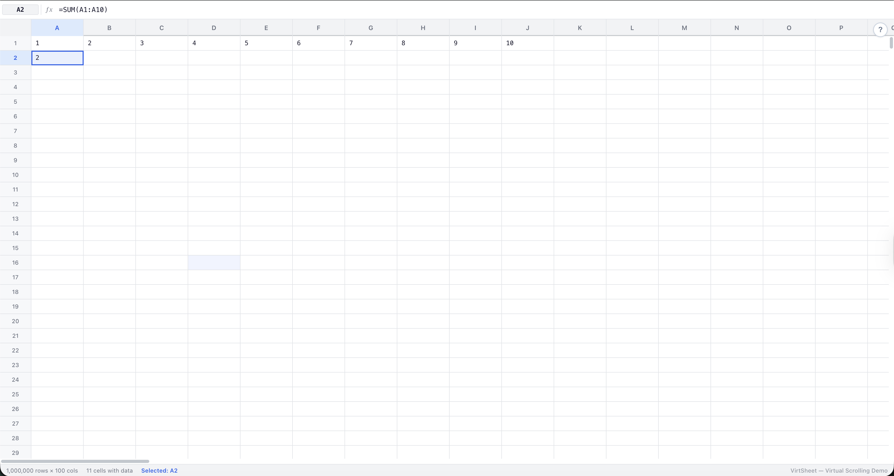
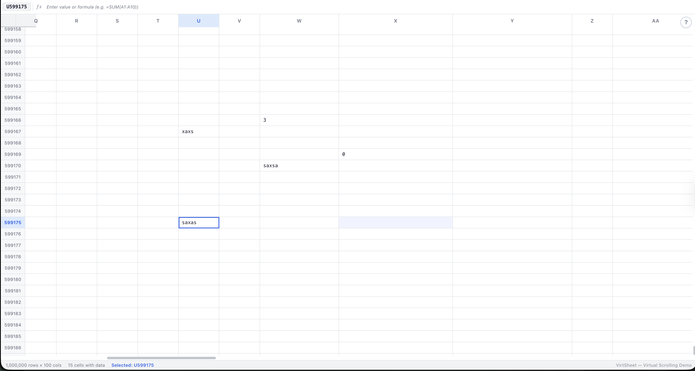

# 📊 VirtSheet (Virtualized Spreadsheet with Formula Engine)

A high-performance, feature-rich spreadsheet application built with React. Handles 1 million rows and 100 columns with smooth virtualization, real-time formula calculations, and advanced editing features. This project demonstrates custom virtualization algorithms, performance optimizations, and scalable data grid patterns.

## ✨ Features

- Virtualized Grid — Smooth scrolling through 1,000,000 rows and 100 columns using custom binary-search-based windowing with overscan
- Formula Engine — Support for arithmetic operations, functions like =SUM(A1:A10), =AVG(B1:B5), =MIN(), =MAX(), =COUNT(), and cell references
- Cell Editing — Click to select, double-click or type to edit, Enter/Tab to confirm, arrow keys to navigate
- Resizable Columns — Drag column headers to resize with minimum width constraints
- Sticky Headers — Row numbers and column headers remain visible during scroll
- Formula Bar — Displays raw formula for selected cell with direct editing capability
- Status Bar — Shows grid dimensions, cell count, and selected cell reference
- Keyboard Navigation — Full keyboard support for navigation and editing
- Auto-Recalculation — Formulas update automatically when dependencies change
- Pure CSS Design — Custom design system with CSS custom properties, no external UI libraries

## 📸 Screenshots

### Main Spreadsheet Interface






## 🎯 Quick Validation

Use these steps to verify all features:

- Virtual Scrolling — Scroll quickly through rows (1M rows) and columns (100 cols); verify smooth performance and only visible cells render
- Cell Editing — Click a cell to select, double-click or press Enter to edit, type a value, press Enter to confirm
- Formulas — Type =A1+B1 in a cell (arithmetic), =SUM(A1:A5) (sum range), =AVG(B1:B10), =MIN(C1:C5), =MAX(D1:D3), =COUNT(A1:A10); verify calculations
- Formula Bar — Select a formula cell; the top bar should show the raw formula and allow editing
- Column Resize — Drag the right edge of any column header to resize; minimum width is 40px
- Keyboard Navigation — Use arrow keys to move, Enter to edit, Escape to cancel, Tab to confirm and move right, Delete/Backspace to clear
- Auto-Recalc — Change a value in A1; dependent formulas should update instantly
- Status Bar — Bottom bar displays selected cell reference (e.g., A1) and total cells with data
- Tour Guide — Click the ? button in top-right for an interactive 9-step walkthrough

## 🚀 Getting Started

### Prerequisites

- Node.js 18+
- npm or yarn

### Installation

```bash
# Clone the repository
git clone https://github.com/priya1793/advanced-react-patterns.git

# Navigate to the project
cd virtuosogrid

# Install dependencies
npm install

# Start the development server
npm run dev
```

## Quick Start

- Open the app and click the ? button for a guided tour
- Click any cell to select it, use arrow keys to navigate
- Double-click a cell or press Enter to start editing
- Type formulas starting with = (e.g., =SUM(A1:A10))
- Drag column edges to resize
- Scroll through millions of rows and columns seamlessly

## 🏗️ Architecture

### Tech Stack

- Frontend: React 19+ with TypeScript
- Virtualization: Custom hooks with binary search algorithms
- Formula Engine: Lightweight parser supporting functions and ranges
- State Management: React hooks with refs for performance
- Styling: Pure CSS with custom properties
- Performance: React.memo, useCallback, useMemo optimizations

## Performance Optimizations

- CCustom Virtualizer Hook — Binary search for visible range calculation, overscan for smooth scrolling
- Measurement Caching — useRef for DOM measurements, dynamic size handling
- Memoized Components — React.memo for cells, stable callbacks with useCallback
- Formula Evaluation — Dependency tracking with Set for circular reference prevention
- Render Optimization — Only visible cells in DOM, efficient re-renders

## 📝 License

MIT License — see LICENSE file for details.
